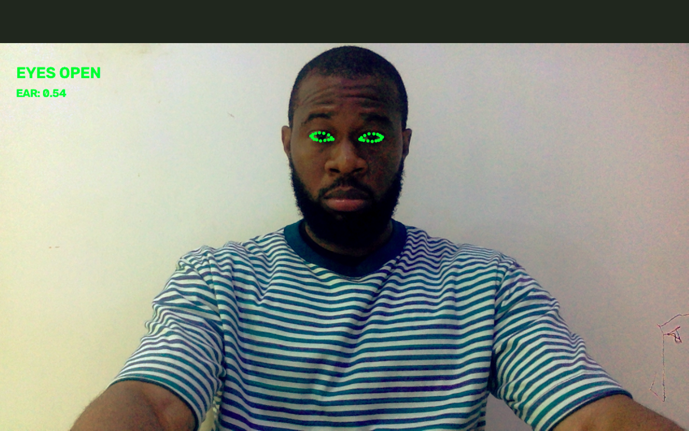

# VirgilDrive

### Real-time driver drowsiness detection using computer vision.

VirgilDrive is a computer vision project I'm building to detect prolonged eye closure and alert a driver when drowsiness is detected.



The current prototype uses a webcam, OpenCV, and MediaPipe Face Landmarker to track the driver's eyes in real time.

## How it works

```text
Webcam
   ↓
OpenCV
   ↓
MediaPipe Face Landmarker
   ↓
Facial landmarks
   ↓
Eye landmarks
   ↓
EAR calculation
   ↓
Eye closure duration
   ↓
Drowsiness detection
   ↓
Audio alarm
```

The system calculates the **Eye Aspect Ratio (EAR)** using six landmarks around the eye:

```text
33, 160, 158, 133, 153, 144
```

A lower EAR indicates that the eye is closing. However, a normal blink can also produce a low EAR, so the system also measures **how long the eyes remain closed**.

In the current prototype:

```text
EAR < 0.25
      ↓
Start timer
      ↓
Eyes remain closed for 2+ seconds
      ↓
DROWSINESS DETECTED
```

If the eyes open again, the timer resets.

The EAR threshold was chosen from my own calibration experiments rather than assuming one universal value.

## Features

* Real-time webcam processing
* Facial landmark detection with MediaPipe
* Eye landmark extraction
* Eye Aspect Ratio calculation
* Time-based drowsiness detection
* On-screen detection status
* Audio warning alarm

## Technology

* Python
* OpenCV
* MediaPipe
* NumPy
* SoundDevice

## Project structure

```text
VirgilDrive/
├── assets/
│   └── face_landmarker.task
├── src/
│   └── drowsiness_detector.py
├── main.py
├── requirements.txt
├── .gitignore
└── README.md
```

## Setup

Clone the repository:

```bash
git clone https://github.com/Pipsmuncher/VirgilDrive.git
cd VirgilDrive
```

Create and activate a virtual environment:

```bash
python3 -m venv .venv
source .venv/bin/activate
```

Install the dependencies:

```bash
pip install -r requirements.txt
```

Run the application:

```bash
python main.py
```

Press `q` to quit.

## Current limitations

This is an early prototype. It currently relies on a standard webcam and works best under reasonable lighting conditions. The detection thresholds have also only been tested in a limited environment.

Future improvements include:

* Better calibration across different users
* Improved low-light detection
* Head-pose and distraction detection
* Yawning detection
* More robust temporal detection
* Testing with infrared cameras
* Moving toward mobile or embedded hardware

## What I learned

I started VirgilDrive as a practical way to learn computer vision. I began with basic OpenCV operations such as cropping, resizing, coordinates, drawing, grayscale conversion, thresholding, rotation, flipping, and translation.

I then moved into MediaPipe facial landmarks and used those landmarks to build the eye-tracking and drowsiness detection logic.

The project is still evolving, but the goal is to eventually combine multiple visual signals rather than relying only on eye closure.

## Author

**Obum Okafor**

Computer Vision • Machine Learning • Robotics

> VirgilDrive is an experimental research and learning project and is not a certified automotive safety system.
